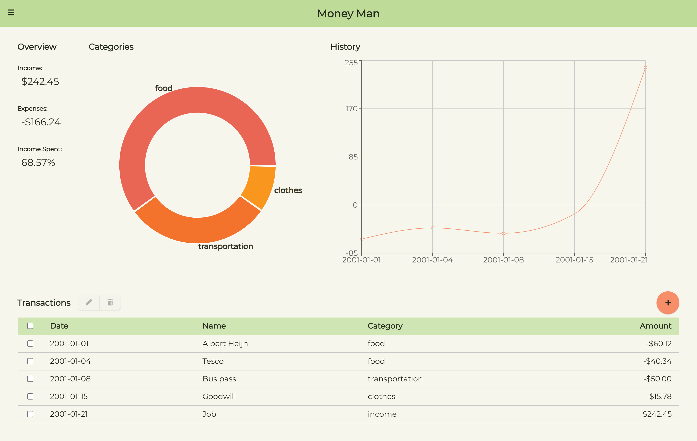

# Money Man 

A simple spending tracking and budgeting app made with Electron and React.

🚧 **Project is still in development, but basic functionality is present.** 🚧

## Completed Features
- Adding, editing, and deleting transactions
- Populating visualizations and cards based on transaction data
- Saving data to file
- Loading data from file

## Planned Features
- Adding budgets/spending goals
- Improved or customizable visualizations

## Tools Used
- [Electron](https://www.electronjs.org)
- [React](https://reactjs.org) / [Create React App](https://create-react-app.dev)
- [Recharts](https://recharts.org)
- [fs-jetpack](https://github.com/szwacz/fs-jetpack)
- [fontawesome](https://fontawesome.com)
